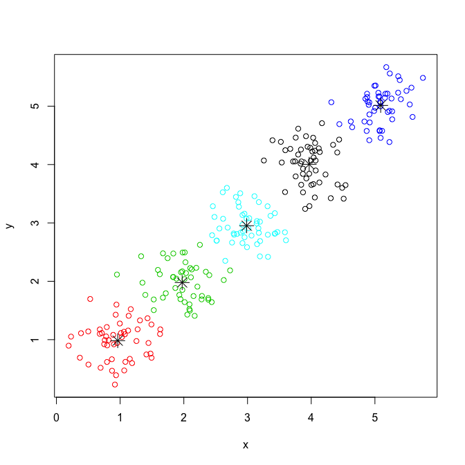

<!-- badges: start -->

[](https://CRAN.R-project.org/package=tglkmeans)
[](https://app.codecov.io/gh/tanaylab/tglkmeans?branch=master)
[](https://github.com/tanaylab/tglkmeans/actions/workflows/R-CMD-check.yaml)
<!-- badges: end -->

# tglkmeans - efficient implementation of kmeans++ algorithm

This package provides R binding to a cpp implementation of the [kmeans++
algorithm](https://en.wikipedia.org/wiki/K-means%2B%2B).

## Installation

You can install the released version of **tglkmeans** using the
following command:

``` r
install.packages("tglkmeans")
```

Or install the development version using:

``` r
if (!require("remotes")) install.packages("remotes")
remotes::install_github("tanaylab/tglkmeans")
```

## Basic usage

``` r
library(tglkmeans)
```

Create 5 clusters normally distributed around 1 to 5, with sd of 0.3:

``` r
data <- rbind(
    matrix(rnorm(100, mean = 1, sd = 0.3), ncol = 2),
    matrix(rnorm(100, mean = 2, sd = 0.3), ncol = 2),
    matrix(rnorm(100, mean = 3, sd = 0.3), ncol = 2),
    matrix(rnorm(100, mean = 4, sd = 0.3), ncol = 2),
    matrix(rnorm(100, mean = 5, sd = 0.3), ncol = 2)
)
colnames(data) <- c("x", "y")
head(data)
#>              x         y
#> [1,] 0.9399229 0.8845469
#> [2,] 1.3150523 0.8857986
#> [3,] 1.0690177 1.1334614
#> [4,] 0.7128039 0.7431859
#> [5,] 0.4193698 1.1405633
#> [6,] 1.2876690 0.9883643
```

Cluster using kmeans++:

``` r
km <- TGL_kmeans(data, k = 5, id_column = FALSE)
km
#> $cluster
#>   1   2   3   4   5   6   7   8   9  10  11  12  13  14  15  16  17  18  19  20 
#>   1   1   1   1   1   1   1   1   1   1   1   1   1   1   1   1   1   1   1   1 
#>  21  22  23  24  25  26  27  28  29  30  31  32  33  34  35  36  37  38  39  40 
#>   1   1   1   1   1   1   1   1   1   1   1   1   1   1   1   1   1   1   1   1 
#>  41  42  43  44  45  46  47  48  49  50  51  52  53  54  55  56  57  58  59  60 
#>   1   1   1   1   1   1   1   1   1   1   2   2   2   2   2   2   2   2   2   2 
#>  61  62  63  64  65  66  67  68  69  70  71  72  73  74  75  76  77  78  79  80 
#>   2   2   2   2   2   2   2   2   2   2   2   2   2   2   2   2   2   2   2   2 
#>  81  82  83  84  85  86  87  88  89  90  91  92  93  94  95  96  97  98  99 100 
#>   2   2   2   2   2   2   2   2   2   2   2   2   2   2   2   2   2   2   2   2 
#> 101 102 103 104 105 106 107 108 109 110 111 112 113 114 115 116 117 118 119 120 
#>   3   3   3   3   3   3   4   3   3   3   3   3   3   3   3   3   3   3   3   3 
#> 121 122 123 124 125 126 127 128 129 130 131 132 133 134 135 136 137 138 139 140 
#>   3   3   3   3   3   3   3   3   3   3   3   3   3   3   3   3   3   3   3   3 
#> 141 142 143 144 145 146 147 148 149 150 151 152 153 154 155 156 157 158 159 160 
#>   2   3   3   3   3   3   3   3   3   3   4   4   4   4   4   4   4   4   4   4 
#> 161 162 163 164 165 166 167 168 169 170 171 172 173 174 175 176 177 178 179 180 
#>   4   4   4   4   4   4   4   4   4   4   4   4   4   4   5   4   5   4   4   4 
#> 181 182 183 184 185 186 187 188 189 190 191 192 193 194 195 196 197 198 199 200 
#>   4   4   4   4   4   4   4   4   4   4   4   4   4   4   4   4   4   4   4   4 
#> 201 202 203 204 205 206 207 208 209 210 211 212 213 214 215 216 217 218 219 220 
#>   5   5   5   5   5   5   5   5   5   5   5   5   4   5   5   5   5   5   5   5 
#> 221 222 223 224 225 226 227 228 229 230 231 232 233 234 235 236 237 238 239 240 
#>   5   5   5   5   5   5   5   5   5   5   5   5   5   5   5   5   5   5   5   5 
#> 241 242 243 244 245 246 247 248 249 250 
#>   5   5   5   5   5   5   5   5   5   5 
#> 
#> $centers
#>             x        y
#> [1,] 1.015769 1.025221
#> [2,] 2.025743 2.022156
#> [3,] 2.985030 2.857020
#> [4,] 4.049870 3.921439
#> [5,] 4.998449 4.983747
#> 
#> $size
#>  1  2  3  4  5 
#> 50 51 48 50 51
```

Plot the results:

``` r
plot(data, col = km$cluster)
points(km$centers, pch = 8, cex = 2)
```

<!-- -->

## Vignette

Please refer to the package vignettes for usage and workflow, or look at
the [usage](https://tanaylab.github.io/tglkmeans/articles/usage.html)
section in the site.

``` r
browseVignettes("usage")
```

## A note regarding random number generation

From version 0.4.0 onward, the package uses R random number generation
functions instead of the C++11 random number generation functions. Note
that this may result in different results from previous versions. To get
the same results as previous versions, set the `use_cpp_random` argument
to `TRUE` in the `TGL_kmeans` function.
